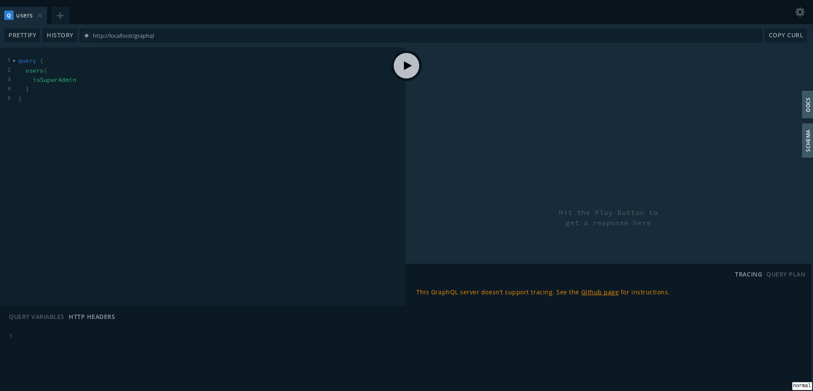
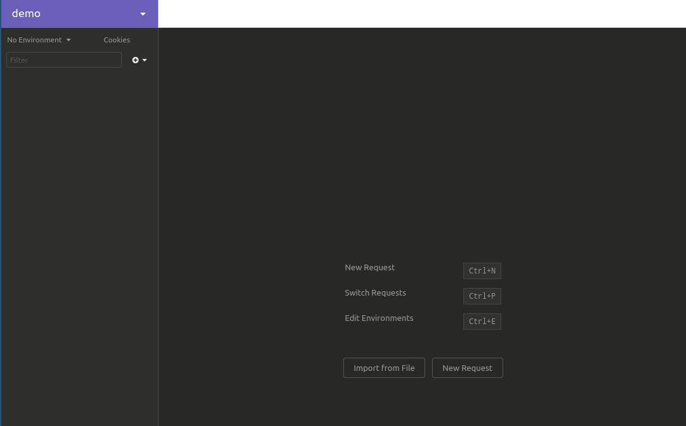
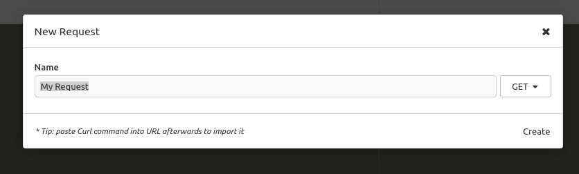
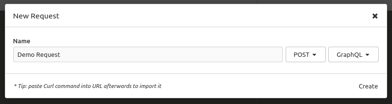
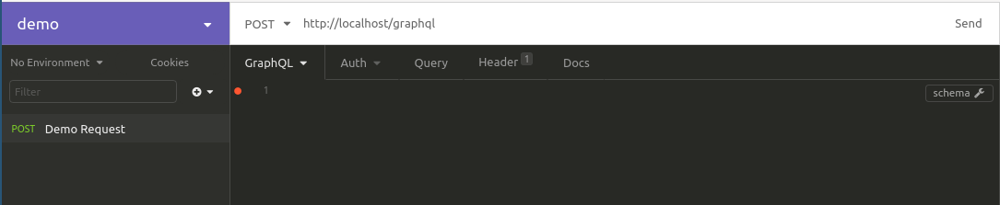
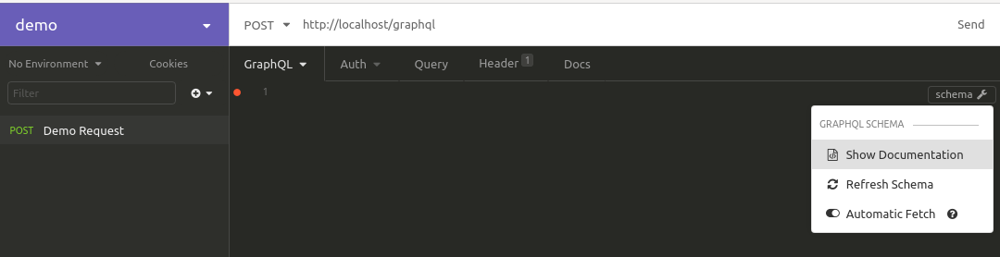
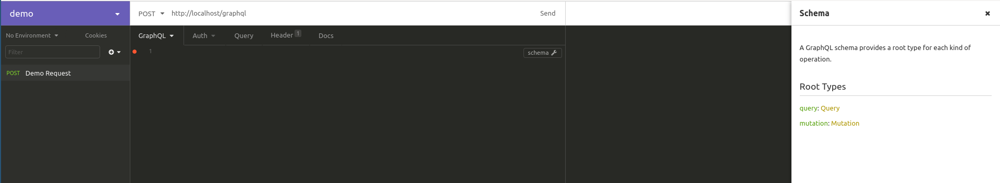
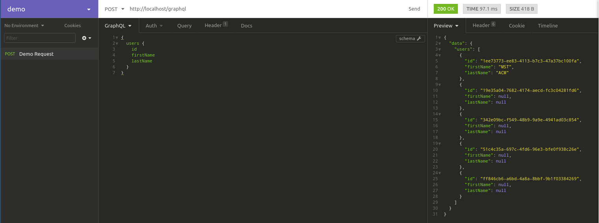
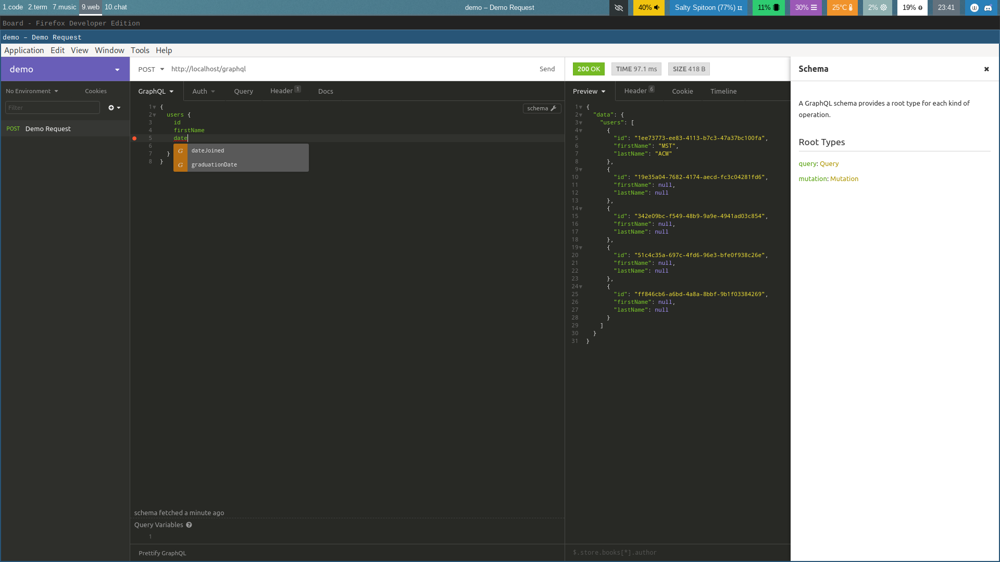

# api.mstacm.org
[View Live](https://api.mstacm.org) |
[Report Bug](https://github.com/sigdotcom/mstacm.org/issues) |
[Request Feature](https://github.com/sigdotcom/mstacm.org/issues)

[api.mstacm.org](https://api.mstacm.org) is the primary [Apollo GraphQL
API](https://www.apollographql.com/) that drives all database interactions from
all frontend clients. Primary features include but are not limited to:
+ **Payment Processing** - Process arbitrary payments using
  [Stripe](https://stripe.com)
+ **Event Management** - Create, modify, and delete ACM events
+ **Permission** - Scope-based permission system that allow for groups of
  permissions
+ **JWT Authentication** - Authenticate users with [Auth0](https://auth0.com)
  JWT tokens

<!-- TABLE OF CONTENTS -->
## Table of Contents

* [Getting Started](#getting-started)
  * [Prerequisites](#prerequisites)
  * [Installation](#installation)
* [Usage](#usage)
* [Roadmap](#roadmap)
* [Contributing](#contributing)
* [License](#license)
* [Contact](#contact)


<!-- GETTING STARTED -->
## Getting Started

To get a local copy up and running follow these simple steps.

### Prerequisites
+ [Git](https://git-scm.com/download/)
+ [Docker](https://docs.docker.com/install/)
+ [Docker Compose](https://docs.docker.com/compose/install/)
+ [NodeJS](https://nodejs.org/en/)
+ [Yarn](https://yarnpkg.com/)

### Installation
 
1. Clone the mstacm.org repository using Git Bash:
```sh
# Make sure to setup ssh keys on your github account
# https://help.github.com/en/articles/adding-a-new-ssh-key-to-your-github-account
git clone git@github.com:sigdotcom/mstacm.org.git
```
2. Navigate to the `api` directory:
```sh
cd api
```

3. Install necessary dependencies:
```sh
yarn install
```

4. Copy the docker environment variables template into the docker environment
   file:
```sh
cp .docker/web.env.default .docker/web.env
```
5. Start the docker containers using `docker-compose`:
```sh
docker-compose up
```
6. If everything goes well, the last lines of output should look like:
```bash
>>> docker-compose up
# ... meaningless output ...
phoenix_web_1    | Server is running, GraphQL Playground available at:
phoenix_web_1    |
phoenix_web_1    |       http://localhost/graphql || http://localhost:4000/graphql
```
7. Navigate to [http://localhost/graphql](http://localhost/graphql). **NOTE**:
   if you are using Docker on Windows 10 Home, you need to put the IP of your
   docker-machine instead of `localhost`. This is usually something like
   `192.168.99.100`. The IP can be found by launching the `Docker Quickstart
   Terminal` and looking at the top of the terminal or by running:
    ```
    docker-machine inspect --format='{{.Driver.IPAddress}}' default
    ```
    

   If the IP is correct, You should see something like:




<!-- USAGE EXAMPLES -->
## Usage

To interact with [api.mstacm.org](https://api.mstacm.org), we recommend
installing [Altair](https://altair.sirmuel.design/) or
[Insomnia][insomnia].  [Altair](https://altair.sirmuel.design/) by
itself is a much better GraphQL client, but [Insomnia][insomnia]
is quickly catching up in terms of GraphQL-specific features and has more
features in-general.

We will use [Insomnia][insomnia] to show off basic usage,
but the lessons apply to both clients.

### Your First Query
1. Open the [Insomnia][insomnia] client:
[](images/insomnia-initial-page.png)

2. Click the `New Request` button or use the keyboard shortcut on the primary
   page. This will show:
[](images/insomnia-new-request.png)

3. Change 'GET' -> 'POST' and 'No Body' -> 'GraphQL'. This will look like:
[](images/insomnia-completed-request.png)

4. Click 'Create' to create the new query. This will send you back the main
   screen.

5. Add the URL you connected to in the [Installation](#installation) section to
   the URL bar on the top. This will look like:
[](images/insomnia-adding-url.png)

6. Wait a couple of seconds and click the 'show schema' button on the right.
   This will look like:
[](images/insomnia-show-documentation.png)

7. Click 'Show Documentation' which should open up a menu on the right like:
[](images/graphql-localhost-playground.png)

8. If you do not see the picture above, go back through the instructions and
   make sure you followed everything correctly.

9. Look through the documentation to see all of the features the api has.

10. Play around with the [Insomnia][insomnia] schema-based auto-completion by typing in some
    sample commands and hitting 'send':
[](images/insomnia-first-query.png)
[](images/graphql-localhost-playground.png)


<!-- ROADMAP -->
## Roadmap

See the [open issues](https://github.com/sigdotcom/mstacm.org/issues) for a list of proposed features (and known issues).


<!-- CONTRIBUTING -->
## Contributing

Contributions are what make the open source community such an amazing place to
be learn, inspire, and create. Any contributions you make are **greatly
appreciated**.

If you **are** apart of ACM Web:
1. Ask the Chair of ACM Web to add you to the [sigdotcom
   organization][sigdotcom-organization]
2. Create your Feature Branch (`git checkout -b feature/AmazingFeature`)
3. Commit your Changes (`git commit -m 'Add some AmazingFeature'`)
4. Push to the Branch (`git push origin feature/AmazingFeature`)
5. Open a Pull Request

If you **are not** apart of ACM Web:
1. Fork the Project
2. Create your Feature Branch (`git checkout -b feature/AmazingFeature`)
3. Commit your Changes (`git commit -m 'Add some AmazingFeature'`)
4. Push to the Branch (`git push origin feature/AmazingFeature`)
5. Open a Pull Request


<!-- LICENSE -->
## License

Distributed under the MPL-2.0 License. See `LICENSE` for more information.


<!-- CONTACT -->
## Contact

ACM Web - acm@mst.edu

Project Link: [https://github.com/sigdotcom/mstacm.org](https://github.com/sigdotcom/mstacm.org)


<!-- MARKDOWN LINKS & IMAGES -->
<!-- https://www.markdownguide.org/basic-syntax/#reference-style-links -->
[insomnia]: https://insomnia.rest
[sigdotcom-organization]: https://github.com/sigdotcom/
[contributors-shield]: https://img.shields.io/github/contributors/sigdotcom/mstacm.org.svg?style=flat-square
[contributors-url]: https://github.com/sigdotcom/mstacm.org/graphs/contributors
[forks-shield]: https://img.shields.io/github/forks/sigdotcom/mstacm.org.svg?style=flat-square
[forks-url]: https://github.com/sigdotcom/mstacm.org/network/members
[stars-shield]: https://img.shields.io/github/stars/sigdotcom/mstacm.org.svg?style=flat-square
[stars-url]: https://github.com/sigdotcom/mstacm.org/stargazers
[issues-shield]: https://img.shields.io/github/issues/sigdotcom/mstacm.org.svg?style=flat-square
[issues-url]: https://github.com/sigdotcom/mstacm.org/issues
[license-shield]: https://img.shields.io/github/license/sigdotcom/mstacm.org?style=flat-square
[license-url]: https://github.com/sigdotcom/mstacm.org/blob/master/LICENSE.txt
