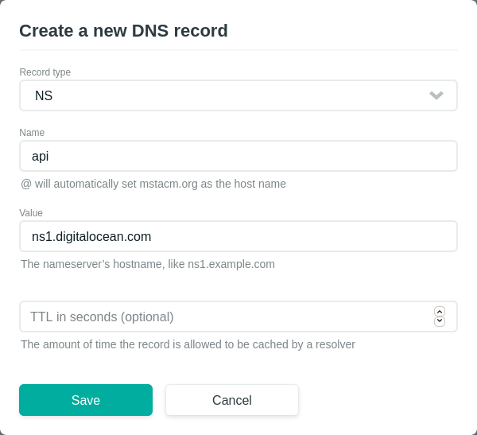

# Deployment
Automated deployment of the \*.mstacm.org application stack using
[ansible][ansible-url] and [terraform][terraform-url]. The installation
instructions below will assume prior knowledge of [ansible][ansible-url] and
[terraform][terraform-url]. **NOTE**: deployment is only supported on a linux
machine. If you have a Windows computer, please use a linux jumpbox such as
`acmvm1.srv.mst.edu`.

<!-- TABLE OF CONTENTS -->
## Table of Contents

* [Getting Started](#getting-started)
  * [Prerequisites](#prerequisites)
  * [Installation](#installation)
* [Usage](#usage)


<!-- GETTING STARTED -->
## Getting Started

To get a local copy up and running follow these simple steps.

### Prerequisites
+ [Git](https://git-scm.com/download/)
+ [Ansible][ansible-url]
+ [Terraform][terraform-url]
+ Make sure you have access to the mstacm team in
  [DigitalOcean][digitalocean-url]. Ask the chair of ACM Web for access.
+ Make sure you have access to the mstacm team in [netlify][netlify-url]. Ask
  the chair of ACM Web for access.

### Installation
1. Clone the mstacm.org repository using Git Bash:
```sh
# Make sure to setup ssh keys on your github account
# https://help.github.com/en/articles/adding-a-new-ssh-key-to-your-github-account
git clone git@github.com:sigdotcom/mstacm.org.git
```

2. Navigate into the repository directory:
```sh
cd mstacm.org
```

## Usage
1. Navigate to the deploy directory:
    ```sh
    cd deploy
    ```

2. Generate a ssh key at `~/.ssh/mstacm-digitalocean` to access the virtual
   machines (where `{HOME_DIR}` is the actual path to your home directory):
    ```sh
    $ ssh-keygen -t rsa -b 4096
    Generating public/private rsa key pair.
    Enter file in which to save the key ({HOME_DIR}/.ssh/id_rsa): {HOME_DIR}/.ssh/mstacm-digitalocean
    ...
    ```

3. Generate a DigitalOcean Access Token with the [How to Create a Personal
   Access Token
   documentation](https://www.digitalocean.com/docs/api/create-personal-access-token/)
   with read/write scopes. Save the access token for later. **NOTE**: make sure are in the
   mstacm project in DigitalOcean (See [prerequisites](#prerequisites) for more
   details).

4. Generate a [DigitalOcean spaces][digitalocean-spaces-url] access key and
   secret by following the [Manage Admin Access to Spaces
   documentation](https://www.digitalocean.com/docs/spaces/how-to/administrative-access/).
   Save the access key and secret for later. **NOTE**: make sure are in the
   mstacm project in DigitalOcean (See [prerequisites](#prerequisites) for more
   details).

5. Copy `terraform.tfvars.template` to `terraform.tfvars`
    ```sh
    cp terraform.tfvars.template terraform.tfvars
    ```

6. Add the DigitalOcean Access Token and Spaces keys to the appropriate
   variables in `terraform.tfvars`

7. Open up the [mstacm project][netlify-project-url] in [netlify][netlify-url].

8. Navigate to the [domains tab][netlify-dns-url] and select `mstacm.org`.

9. Add NS records for `api.mstacm.org` that point to the [DigitalOcean
   Nameservers](https://www.digitalocean.com/community/tutorials/how-to-point-to-digitalocean-nameservers-from-common-domain-registrars)
   to netlify DNS records. The properties should look like: 
   

   If completed properly it should look like (as of 2019-10-27):
   

10. Run terraform:
    ```sh
    terraform apply
    ```

11. Copy `group_vars/api-prod.yml.template` into `group_vars/api-prod.yml`:
    ```sh
    cp  group_vars/api-prod.yml.template group_vars/api-prod.yml
    ```

12. Navigate to the DigitalOcean dashboard in the mstacm team.

13. Edit the `groups_vars/api-prod.yml` file with the appropriate environment
    variables. Tips on where the acquire the correct values are found in the
    comments of this file.

[ansible-url]: https://docs.ansible.com/ansible/latest/index.html
[terraform-url]: https://www.terraform.io/docs/index.html
[digitalocean-spaces-url]: https://www.digitalocean.com/products/spaces/
[digitalocean-url]: https://cloud.digitalocean.com/
[netlify-url]: https://www.netlify.com/
[netlify-project-url]: https://app.netlify.com/teams/mstacm/sites
[netlify-dns-url]: https://app.netlify.com/teams/mstacm/dns
